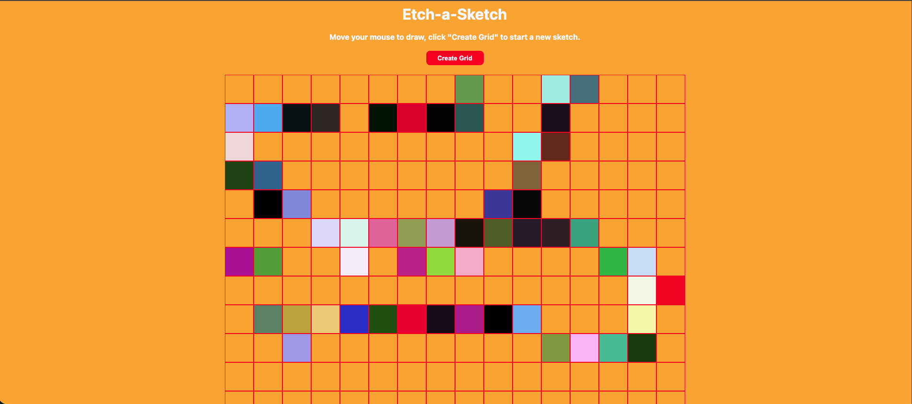

# Etch-a-Sketch

A browser-based drawing grid built with vanilla JavaScript as part of [The Odin Project](https://www.theodinproject.com/lessons/foundations-etch-a-sketch) Foundations curriculum.

## Preview

## Live Demo

[View on GitHub Pages](https://arifmertmisir.github.io/etch-a-sketch/)

## Features

- **nxn grid** generated dynamically with JavaScript
- **Hover-to-draw**: move your mouse over the grid to color squares
- **Random colors**: each square gets a random HSL color on hover
- **Custom grid size**: click "Create Grid" to generate a new grid of any size (1-100) while keeping the total drawing area constant

## How It Works

- The grid container and squares are created entirely with `document.createElement` and `appendChild`
- `mouseover` events trigger random color changes via `getRandomColor()`
- The "Create Grid" button uses `prompt()` to ask for a new grid size, validates the input, clears the old grid, and generates a new one with recalculated square dimensions

## Built With

- HTML
- CSS (Grid layout)
- JavaScript (Vanilla)

## What I Practiced

- Creating and appending DOM elements dynamically
- Event listeners (`click`, `mouseover`) and callbacks
- Input validation (`isNaN`, range checks)
- Refactoring code into smaller, single-purpose functions
